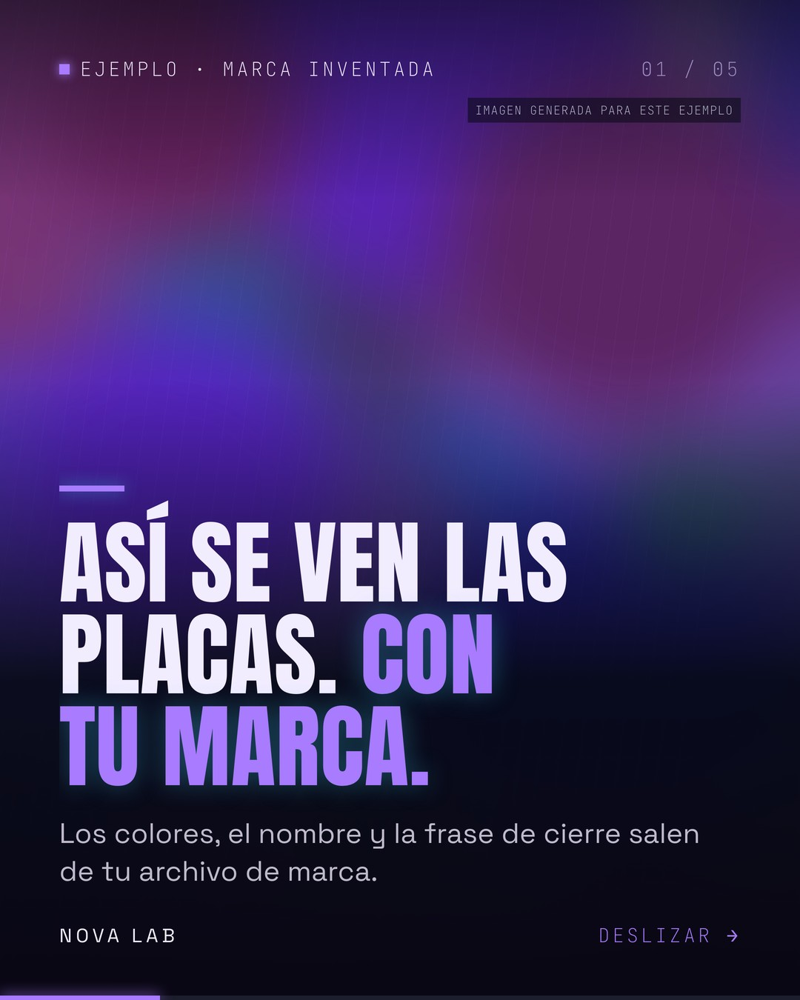
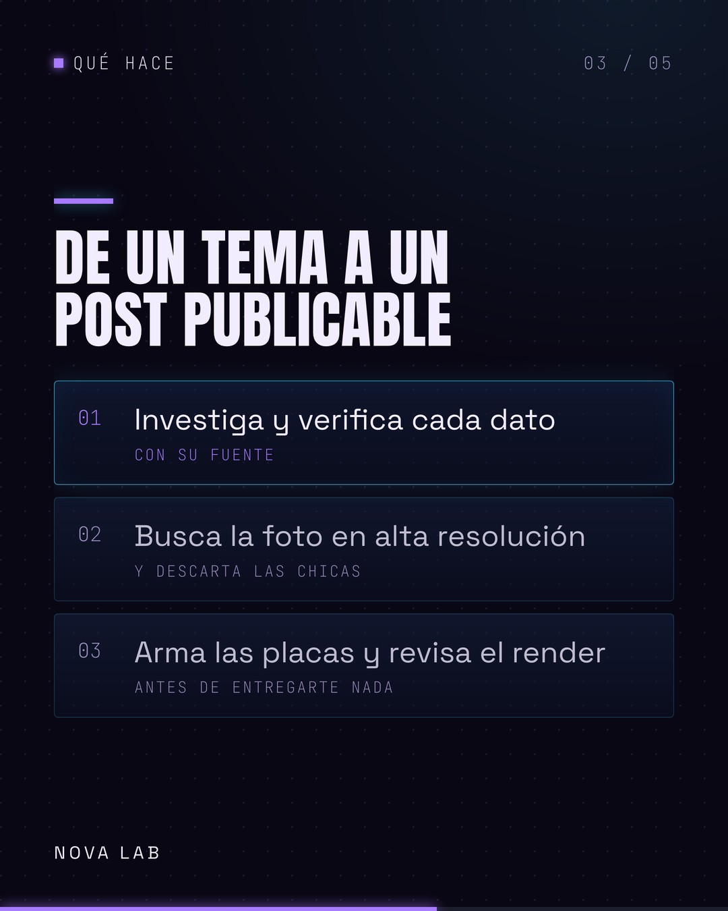
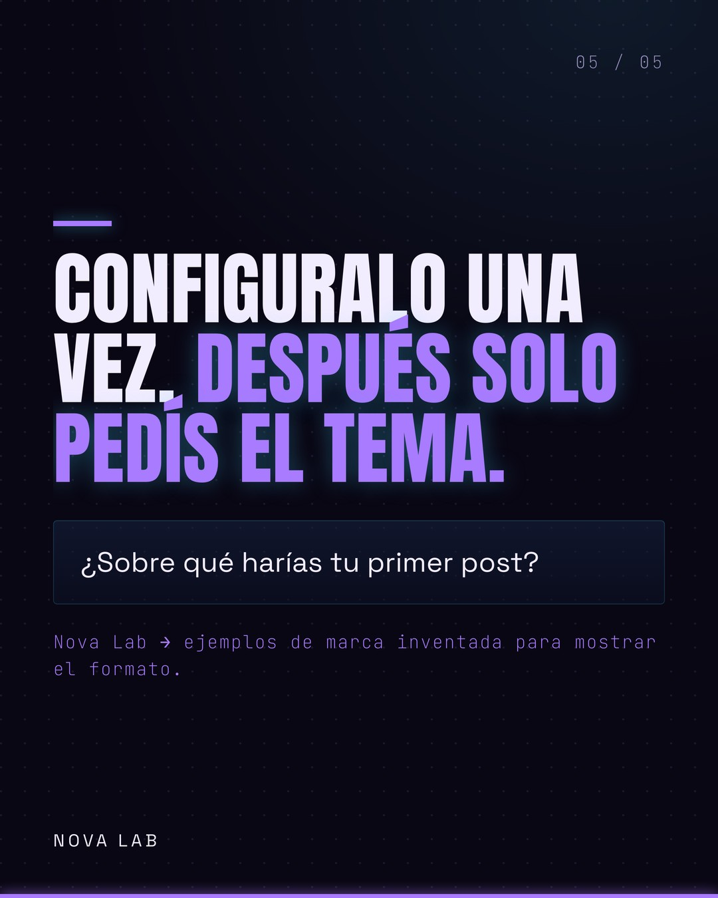

# Skills para Claude Code

Herramientas que uso todos los días para crear contenido, listas para que las uses con tu propia marca. Sin llaves mías, sin mi identidad visual: las configurás la primera vez y quedan tuyas.

| Skill | Qué hace | Qué necesitás |
|---|---|---|
| **linkedin-post-generator** | De un tema o una noticia a un post de LinkedIn listo para publicar: imagen 4:5 o carrusel en PDF, con tu marca, y el texto con cada dato verificado y su fuente | Python 3.10+, un navegador (Chrome, Brave, Edge o Chromium) y una cuenta de Apify para buscar fotos. Cuesta centavos por post |
| **cine-ia** | Pipeline de 9 pasos para producir un cortometraje con IA, de la idea al video listo para YouTube: guion, personajes consistentes, imágenes, video, voz y montaje | Nada instalado. Necesitás cuentas en las herramientas de imagen, video y voz que uses |

## Instalar

Dentro de Claude Code:

```
/plugin marketplace add ismaelmp-ia/skills
/plugin install linkedin-post-generator@skills
```

O, si preferís hacerlo a mano:

```bash
git clone https://github.com/ismaelmp-ia/skills.git
cp -R skills/linkedin-post-generator/skills/linkedin-post-generator ~/.claude/skills/
```

## Después de instalar linkedin-post-generator

Una sola vez, desde la carpeta del skill:

```bash
bash preparar.sh
```

Crea su propio entorno de Python (no toca el de tu sistema), instala las librerías, baja las tipografías y te avisa si falta el navegador o Apify.

Después abrí Claude Code y pedile **"configurá mi marca para los posts de LinkedIn"**. Te va a preguntar nombre, logo, colores, frase de cierre, voz y dónde guardar los posts, y lo escribe en `mi-marca.json`. Ese archivo es tuyo: no viaja en el repositorio y no se pisa cuando actualices.

Para usarlo, pasale un tema:

```
/linkedin-post-generator la nueva ley de IA en Europa
```

## Cómo se ve

Estas placas están hechas con una marca inventada ("Nova Lab"), solo para mostrar el formato. Con tus colores y tu logo se ven distintas.

| | | |
|---|---|---|
|  |  |  |

## Aviso

Las fotos las busca en internet. El skill descarta las de baja resolución y anota autor y licencia cuando existen, pero **antes de publicar revisá que podés usar esa foto**. Una foto de agencia sin licencia es tu responsabilidad, no la del programa.

## Licencia

MIT. Usalos, modificalos y vendé lo que hagas con ellos. Si los compartís, dejá el crédito.
